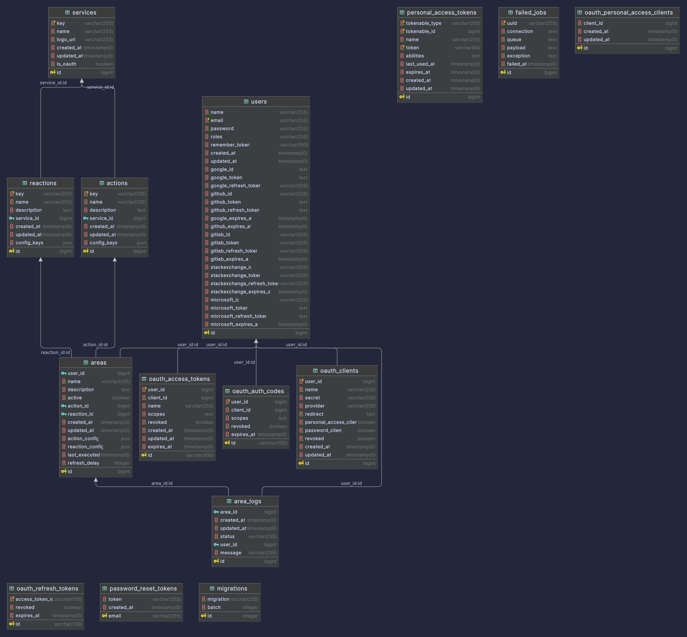

# Area EPITECH

An automation full stack project.

## 1. Server API

Build with Laravel PHP, this service expose a RESTful API.
You can find the detailed documentation for the API [here](https://documenter.getpostman.com/view/19570289/2s9YXcdjuv).
- Install required dependencies: `composer install`
- Start the server: `composer serve`

Data base diagram:

## 2. Frontend Web

Frontend web section made in React js
- Install dependencies: `npm install`
- Run for development: `npm run dev`
- Build the application: `npm run build`
- Preview the application: `npm run preview`

## 3. Frontend Mobile

Frontend Mobile, made in dart with Flutter
- Install dependencies: `flutter pub get && flutter clean`
- Run for development: `flutter dev`
- Build the application: `flutter build apk`

## 4. Deployment

Deploy easily all the service with docker compose
- Start all: `just up`
- Initialize PostGres database: `just init-db`
- Rebuild: `just rebuild`
- Shutdown: `just down`
